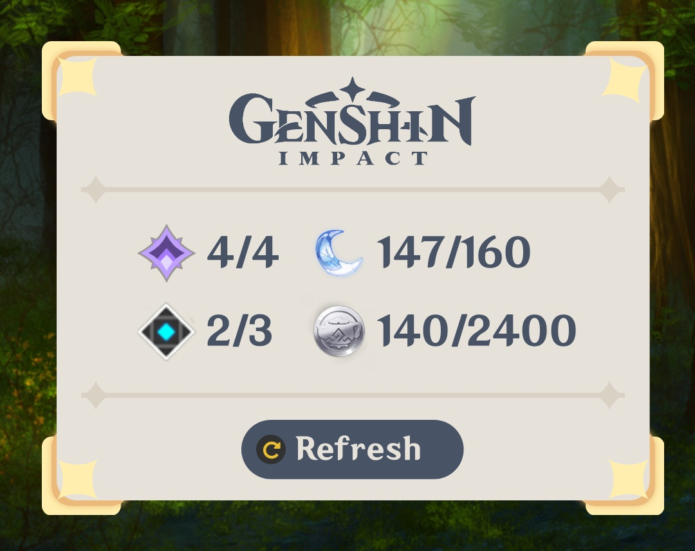

# Genshin Impact Stats

> **WARNING!**\
> This widget is far from ready out-of-the-box,
> it requires two automate flows
> and a web server to function properly.

A widget to show:
- commissions
- weekly bosses
- resin
- realm currency

## Preview

</img>

## Setup

1. Set up a web server to get the data from hoyolab.\
   You can use [mine][server] which requires nodejs,
   or [write your own](server.md).\
   *[why?](server.md#why)*

2. Import the Automate flows into Automate,
   and set the request URLs of their http blocks to your server.

3. Import the komponent into the Kustom app you are using,
   and change the shortcut action of the refresh button to
   start the `resin_once` flow.
   (content > buttons > refresh > touch)

4. Start the `resin_again` flow to make the widget
   auto-refresh.

[server]: https://github.com/AroLeaf/resin-server
